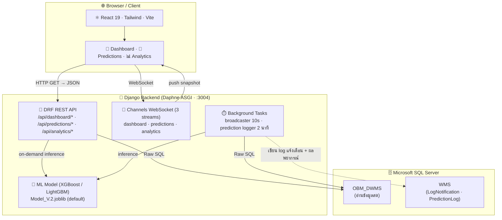

# WMS — Warehouse Management System

> ระบบบริหารจัดการคลังสินค้าแบบ Real-time สำหรับโรงงาน **SB1**
> ติดตามคิวรถบรรทุก · ตรวจสอบสถานะ Yard · วิเคราะห์ข้อมูล · พยากรณ์เวลาโหลดด้วย AI

---

## สารบัญ

- [ภาพรวมระบบ](#ภาพรวมระบบ)
- [การทำงานของระบบ (Business Workflow)](#การทำงานของระบบ-business-workflow)
- [Quick Start](#quick-start)
- [คุณสมบัติหลัก](#คุณสมบัติหลัก)
- [Tech Stack](#tech-stack)
- [สถาปัตยกรรมระบบ](#สถาปัตยกรรมระบบ)
- [โครงสร้างโปรเจกต์](#โครงสร้างโปรเจกต์)
- [การติดตั้งแบบละเอียด](#การติดตั้งแบบละเอียด)
- [Environment Variables](#environment-variables)
- [การรันระบบ](#การรันระบบ)
- [API Endpoints](#api-endpoints)
- [WebSocket (Real-time)](#websocket-real-time)
- [Background Tasks (งานเบื้องหลัง)](#background-tasks-งานเบื้องหลัง)
- [ML Model — การพยากรณ์เวลาโหลด](#ml-model--การพยากรณ์เวลาโหลด)
- [การ Deploy (Production)](#การ-deploy-production)
- [Contributing](#contributing)

> เอกสารเฉพาะส่วน: [backend/README.md](backend/README.md) · [frontend/README.md](frontend/README.md)

---

## ภาพรวมระบบ

WMS เป็น Dashboard แบบ Real-time สำหรับควบคุมและติดตามการโหลดสินค้าในโรงงาน SB1 ตั้งแต่รถเข้าคิวจนออกจากโรงงาน ระบบดึงข้อมูลสด ๆ จากฐานข้อมูล DWMS (Microsoft SQL Server) ด้วย Raw SQL และ push ขึ้นหน้าจอผ่าน WebSocket ทุก 10 วินาที

นอกจากนี้ยังมีโมดูล **Analytics** สำหรับสรุปสถิติย้อนหลัง และโมดูล **AI (XGBoost / LightGBM)** สำหรับพยากรณ์เวลาโหลดของรถแต่ละคัน

| รายละเอียด | ค่า |
|-----------|-----|
| Plant | SB1 (สระบุรี 1) |
| Plant Code | `COM20060001` |
| Timezone | `Asia/Bangkok` (UTC+7) |
| Language | ภาษาไทย |
| ฐานข้อมูล | อ่านจาก `OBM_DWMS` · เขียน log ลง `WMS` |

ระบบมี **3 หน้าหลัก** ตรงกับ 3 โมดูลของระบบ:

| หน้า | URL | ทำอะไร |
|------|-----|--------|
| **ภาพรวม (Dashboard)** | `/` | ดูคิวรถ · Yard · แจ้งเตือน แบบ real-time |
| **รายงานผลโมเดล (Predictions)** | `/predictions` | ดูความแม่นยำของ AI ที่พยากรณ์เวลาโหลด |
| **วิเคราะห์ข้อมูล (Analytics)** | `/analytics` | ดูสถิติย้อนหลัง KPI ปริมาณงาน แนวโน้ม |

---

## การทำงานของระบบ (Business Workflow)

> ส่วนนี้อธิบาย **กระบวนการจริงของรถ 1 คัน** ที่ระบบติดตาม — อ่านส่วนนี้ก็เข้าใจว่าระบบทำอะไรโดยไม่ต้องดูโค้ด

### วงจรชีวิตของรถ 1 คัน (Truck Lifecycle)

รถบรรทุก 1 คันจะผ่าน **6 ขั้นตอน** ตั้งแต่เข้าจนออกโรงงาน แต่ละขั้นตอนมี timestamp บันทึกไว้ในฐานข้อมูล ระบบใช้ timestamp เหล่านี้คำนวณสถานะ เวลาที่ใช้ และการแจ้งเตือน

| # | ขั้นตอน | Timestamp ในระบบ | ความหมาย |
|---|---------|------------------|----------|
| 1 | **ยื่นตั๋ว** | `operatorCarConfirm` | รถเข้าระบบ รอถูกเรียกเข้าช่องโหลด |
| 2 | **เรียกรถ** | `carConfirm` | เจ้าหน้าที่เรียกรถเข้าช่องโหลด |
| 3 | **เริ่มโหลด** | `firstPallet` | พาเลทแรกถูกโหลดขึ้นรถ |
| 4 | **โหลดเสร็จ** | `lastPostPallet` | พาเลทสุดท้ายโหลดเสร็จ |
| 5 | **ปิดงาน** | `checkerClose` | Checker ตรวจและปิดงาน |
| 6 | **Post ออก** | `postingTime` | บันทึกออกระบบ — รถออกจากโรงงาน |

> **เวลารวม (total time)** = เวลาตั้งแต่ขั้น 1 (`operatorCarConfirm`) ถึงขั้น 6 (`postingTime`)
> ถ้าเกิน **120 นาที** จะถูกนับเป็น **"เกินเวลา (overtime)"**

### การแจ้งเตือนอัตโนมัติ (Notification Rules)

ระบบเฝ้าดูทุกช่วงรอยต่อระหว่างขั้นตอน — ถ้ารถ **ค้างอยู่ในขั้นใดนานเกิน threshold** จะแจ้งเตือนทันที
มี **5 กฎ** ([notification_service.py](backend/api/services/notification_service.py)):

| ชื่อไทย | เริ่มจับเวลาเมื่อ | เด้งเตือนเมื่อเกิน | หายเตือนเมื่อ |
| -------- | ---------------- | ----------------- | ------------- |
| รอเรียก | ยื่นตั๋ว (`operatorCarConfirm`) | **5 นาที** | ถูกเรียก (`carConfirm`) |
| รอโหลด | ถูกเรียก (`carConfirm`) | **15 นาที** | เริ่มโหลด (`firstPallet`) |
| โหลดนานเกินไป | เริ่มโหลด (`firstPallet`) | **45 นาที** | โหลดเสร็จ (`lastPostPallet`) |
| รอปิดงาน | โหลดเสร็จ (`lastPostPallet`) | **5 นาที** | Checker ปิด (`checkerClose`) |
| รอ Post | Checker ปิด (`checkerClose`) | **5 นาที** | Post แล้ว (`postingTime`) |

**Flow การแจ้งเตือน:**
1. Backend ประเมินกฎทั้ง 5 ข้อกับรถทุกคัน **ทุก 10 วินาที** (พร้อม dashboard snapshot)
2. ถ้าเข้าเงื่อนไข → ส่งการแจ้งเตือนไปกับ snapshot ผ่าน WebSocket
3. Frontend แสดงเป็น **เสียง + Toast popup** ตามระดับ (เตือน / ส้ม / วิกฤต)
4. บันทึกประวัติทุกการแจ้งเตือนลงตาราง `LogNotification` ในฐานข้อมูล `WMS` (พร้อมระยะเวลาที่ค้าง)

---

## Quick Start

ต้องมี **Python 3.10+**, **Node.js 18+**, **Microsoft SQL Server** และ **ODBC Driver 17 for SQL Server** ก่อน

```bash
# 1) Clone
git clone <repository-url>
cd WMS

# 2) Backend
cd backend
python -m venv venv
venv\Scripts\Activate.ps1          # Windows PowerShell  (macOS/Linux: source venv/bin/activate)
pip install -r requirements.txt

# 3) Frontend  (เปิด terminal ใหม่)
cd frontend
npm install
copy .env.example .env             # ค่า default ชี้ไป http://127.0.0.1:3004

# 4) รัน 2 terminal
# Terminal A (backend):
python -m daphne -b 0.0.0.0 -p 3004 backend.asgi:application
# Terminal B (frontend):
npm run dev
```

เปิดเบราว์เซอร์ที่ **http://localhost:3000** · API docs ที่ **http://localhost:3004/api/docs/**

> บน Windows มีสคริปต์ลัด: ดับเบิลคลิก [wms_backend.bat](wms_backend.bat) และ [wms_frontend.bat](wms_frontend.bat) เพื่อรันแต่ละฝั่ง
> ใช้ `daphne` ไม่ใช่ `runserver` เพราะ WebSocket (real-time) ต้องการ ASGI server

---

## คุณสมบัติหลัก

### Dashboard Real-time
- สรุปจำนวนรถตามสถานะ (`summary`): รถทั้งหมด · รอคิว · กำลังโหลด · เสร็จสิ้น · เกินเวลา
- จำนวนช่องว่าง/ช่องที่กำลังโหลด ดูได้จากข้อมูล `yards` (นับจาก `channel_status`) ไม่ได้อยู่ใน `summary`
- อัปเดตอัตโนมัติทุก **10 วินาที** ผ่าน WebSocket พร้อมแสดงสถานะการเชื่อมต่อ

### คิวรถบรรทุก (Truck Queue)
- รายการรถทุกคัน: ทะเบียน · ประเภทรถ · ประเภทคิว (SmartQ / Walk-in / ล่วงหน้า)
- ข้อมูลสินค้า: กระเบื้อง CPAC / PRESTIGE / NEUSTILE · อุปกรณ์ · อุปกรณ์เสริม
- Timeline 6 ขั้นตอน: ยื่นตั๋ว · เรียกรถ · เริ่มโหลด · โหลดเสร็จ · ปิดงาน · ออก — พร้อมค้นหา/กรอง

### Yard Management
- แผนผัง Yard แบบ Zone แสดงสถานะช่องโหลดทุกช่อง (ว่าง / กำลังโหลด)
- ข้อมูล Forklift: ชื่อพนักงาน · เวลาทำงานล่าสุด · จำนวนรถในช่อง

### การแจ้งเตือน (Notifications)
- ประเมิน **5 rule** ที่ backend ตาม threshold เวลา แล้ว push มากับ snapshot (ดู [Business Workflow](#การทำงานของระบบ-business-workflow))
- บันทึกประวัติลงตาราง `LogNotification` ในฐานข้อมูล `WMS`
- ฝั่ง frontend แสดงเป็นเสียง + Toast popup ตามระดับความเร่งด่วน (เตือน / ส้ม / วิกฤต)

### Analytics
รายงานสถิติย้อนหลังเลือกช่วงเวลาได้ (`today` · `7d` · `30d` · `3m` · `6m` · `1y` หรือกำหนดวันที่เอง)
- **KPI Summary** — ตัวเลขสรุปภาพรวม (จำนวนรถ · เวลารอเฉลี่ย · เวลาโหลดเฉลี่ย · อัตราเกินเวลา)
- **Throughput** — ปริมาณงานต่อช่วงเวลา (จัดกลุ่มราย ชม./วัน)
- **Queue Distribution** — สัดส่วนตามประเภทคิว
- **Product Volume** — ปริมาณสินค้าแยกประเภท
- **Avg Time by Truck Type** — เวลาเฉลี่ยตามประเภทรถ
- **Notification Summary** — สรุปจำนวนการแจ้งเตือนแยกประเภท

### AI Prediction Report
- รายงานความแม่นยำโมเดล ML: MAE · RMSE · Accuracy (±15 นาที)
- เปรียบเทียบเวลาพยากรณ์ vs เวลาจริงรายคัน · Pagination · Filter
- เลือกเปรียบเทียบผลระหว่างโมเดล/เวอร์ชันที่เคยใช้ (XGBoost vs LightGBM) ผ่าน dropdown
- บันทึกผลพยากรณ์ลงตาราง `PredictionLog` ในฐานข้อมูล `WMS` (โดย background job ทุก 2 นาที)

---

## Tech Stack

### Backend

| เทคโนโลยี | เวอร์ชัน | วัตถุประสงค์ |
|-----------|---------|------------|
| Python | 3.10+ | ภาษาหลัก |
| Django | 5.2 | Web framework |
| Django REST Framework | 3.17 | REST API |
| Django Channels | 4.2 | WebSocket (ASGI) |
| Daphne | 4.1 | ASGI server |
| django-cors-headers | 4.9 | CORS |
| drf-spectacular | ≥ 0.27 | OpenAPI docs (Swagger / ReDoc) |
| mssql-django | 1.7 | SQL Server database backend |
| pyodbc | 5.3 | ODBC driver connector |
| XGBoost | 3.2 | ML model v1 (ทำนายเวลาโหลด) |
| LightGBM | 4.6 | ML model v2 — default (ทำนายเวลาโหลด) |
| Pandas / NumPy / SciPy | latest | Data processing |
| joblib | 1.5 | Model serialization |
| python-dotenv | 1.2 | Environment variables |

> `channels_redis` / `redis` ถูกระบุไว้ใน `requirements.txt` แต่ **ยังไม่ได้เปิดใช้** — ปัจจุบัน WebSocket broadcast ทำงานแบบ in-process (ดู [สถาปัตยกรรมระบบ](#สถาปัตยกรรมระบบ))
> `scikit-learn` ต้องติดตั้งเพิ่มเฉพาะตอน **retrain** โมเดล (ไม่จำเป็นสำหรับการรันปกติ)

### Frontend

| เทคโนโลยี | เวอร์ชัน | วัตถุประสงค์ |
|-----------|---------|------------|
| React | 19.0 | UI framework |
| Vite | 6.2 | Build tool & Dev server |
| react-router-dom | 7.17 | Routing |
| Tailwind CSS | 4.1 | Utility-first styling |
| Axios | 1.13 | HTTP client |
| react-use-websocket | 4.13 | WebSocket hook |
| Recharts | 3.8 | กราฟใน Analytics |
| Lucide React | 1.8 | Icon library |
| Material-UI Icons | 7.3 | Supplemental icons |

### Infrastructure

| ส่วนประกอบ | รายละเอียด |
|-----------|-----------|
| Database (read) | Microsoft SQL Server — `OBM_DWMS` |
| Database (write log) | `WMS` — ตาราง `LogNotification`, `PredictionLog` |
| ODBC Driver | ODBC Driver 17 for SQL Server |
| API Protocol | REST + WebSocket |
| Default Port | Backend `3004` · Frontend `3000` |

---

## สถาปัตยกรรมระบบ



**Data Flow:**

1. **REST API** — Frontend เรียก `/api/dashboard/*`, `/api/predictions/*`, `/api/analytics/*` ด้วย HTTP GET รับ JSON (ใช้สำหรับโหลดข้อมูลครั้งแรกและข้อมูลย้อนหลัง)
2. **WebSocket** — Frontend เปิด connection ถาวร 3 stream (dashboard / predictions / analytics) รับ snapshot push ตามรอบ โดย background task สร้าง snapshot แล้วแจกจ่ายผ่าน in-process pub/sub (ไม่ใช้ Redis channel layer)
3. **SQL Server** — Backend ดึงข้อมูลด้วย Raw SQL ผ่าน ODBC Driver 17 (ไม่ใช้ Django ORM); การแจ้งเตือนและผลพยากรณ์ถูกเขียน log ลงฐานข้อมูล `WMS`
4. **ML Model** — โมเดล (default: LightGBM `Model_V.2`) รัน inference เมื่อสร้าง dashboard snapshot และเมื่อ background job บันทึกผลพยากรณ์ — ระบบตรวจชนิดโมเดลอัตโนมัติ รองรับทั้ง XGBoost และ LightGBM

---

## โครงสร้างโปรเจกต์

```
WMS/
├── README.md                       ← เอกสารหลัก
├── wms_backend.bat                 ← สคริปต์รัน backend (Windows)
├── wms_frontend.bat                ← สคริปต์รัน frontend (Windows)
│
├── backend/                        ← ฝั่งเซิร์ฟเวอร์ Django
│   ├── manage.py                   ← ตัวสั่งงาน Django
│   ├── requirements.txt            ← รายการ package ของ Python
│   ├── .env.example                ← ตัวอย่างไฟล์ตั้งค่า
│   │
│   ├── backend/                    ← ตั้งค่าหลักของ project
│   │   ├── settings.py             ← ตั้งค่าระบบ + ฐานข้อมูล
│   │   ├── urls.py                 ← URL หลัก
│   │   ├── asgi.py                 ← จุดเริ่ม ASGI + WebSocket + background task
│   │   └── wsgi.py                 ← จุดเริ่มแบบ WSGI (สำรอง)
│   │
│   ├── api/                        ← แอปหลัก
│   │   ├── views.py                ← ฟังก์ชัน API
│   │   ├── urls.py                 ← URL ของ API
│   │   ├── models.py               ← ว่าง (ใช้ raw SQL)
│   │   ├── websocket.py            ← ตัวจัดการ WebSocket
│   │   ├── constants.py            ← ค่าคงที่ของระบบ
│   │   ├── tests.py                ← unit test
│   │   ├── services/               ← logic ธุรกิจ
│   │   ├── utils/                  ← ตัวช่วยใช้ร่วม (ต่อ DB, วันที่, SQL)
│   │   └── ml/                     ← โค้ด Machine Learning
│   │
│   ├── model/                      ← ไฟล์โมเดลที่เทรนแล้ว
│   │   ├── Model_V.1.joblib              ← โมเดล XGBoost (เวอร์ชัน 1)
│   │   ├── Model_V.2.joblib              ← โมเดล LightGBM (เวอร์ชัน 2 · default)
│   │   └── feature_metadata.json         ← ข้อมูลประกอบโมเดล
│   │
│   └── sql/                        ← สคริปต์ SQL เสริม
│
└── frontend/                       ← ฝั่งหน้าเว็บ React
    ├── package.json                ← dependency + คำสั่ง npm
    ├── vite.config.js              ← ตั้งค่า Vite
    ├── .env.example                ← ตัวอย่างไฟล์ตั้งค่า
    │
    └── src/                        ← โค้ดหน้าเว็บ
        ├── app/                    ← จุดเริ่มแอป + เส้นทางหน้า
        ├── features/               ← โค้ดแยกตามฟีเจอร์
        ├── shared/                 ← ของใช้ร่วมกัน
        ├── services/               ← ตัวเรียก API/WebSocket
        ├── config/                 ← อ่านค่าจาก .env
        ├── layouts/                ← โครงหน้าร่วม
        ├── pages/                  ← หน้าเพจ
        └── styles/                 ← ไฟล์ CSS
```

---

## การติดตั้งแบบละเอียด

### ข้อกำหนดเบื้องต้น

| ซอฟต์แวร์ | เวอร์ชันขั้นต่ำ | หมายเหตุ |
|-----------|--------------|---------|
| Python | 3.10+ | [python.org](https://www.python.org/) |
| Node.js | 18+ | [nodejs.org](https://nodejs.org/) |
| npm | 9+ | มาพร้อม Node.js |
| Microsoft SQL Server | 2017+ | หรือ Azure SQL |
| ODBC Driver 17 for SQL Server | 17.x | [Microsoft Docs](https://learn.microsoft.com/en-us/sql/connect/odbc/download-odbc-driver-for-sql-server) |

ขั้นตอนการติดตั้งดูที่ [Quick Start](#quick-start) ด้านบน — ด้านล่างนี้คือรายละเอียดเฉพาะจุดที่ต้องระวัง

**เปิดใช้งาน Virtual Environment ตาม OS:**

```powershell
venv\Scripts\Activate.ps1      # Windows PowerShell
```
```cmd
venv\Scripts\activate.bat      # Windows CMD
```
```bash
source venv/bin/activate       # macOS / Linux
```
> activate สำเร็จจะเห็น `(venv)` นำหน้า prompt

**สร้างค่า `DJANGO_SECRET_KEY`:**
```bash
python -c "from django.core.management.utils import get_random_secret_key; print(get_random_secret_key())"
```

---

## Environment Variables

### Backend (`backend/.env`) — คัดลอกจาก `backend/.env.example`

ฐานข้อมูลแยกเป็น **2 ชุด**: ชุดหลัก (`DB_*`) สำหรับอ่านข้อมูลจาก `OBM_DWMS` และชุด log (`LOG_DB_*`) สำหรับเขียนประวัติแจ้งเตือน/ผลพยากรณ์ลง `WMS`

| Variable | ตัวอย่าง | คำอธิบาย |
|----------|---------|---------|
| `DJANGO_SECRET_KEY` | `django-insecure-...` | Django secret key |
| `DJANGO_DEBUG` | `True` / `False` | Debug mode |
| `DJANGO_ALLOWED_HOSTS` | `127.0.0.1,localhost` | hosts ที่อนุญาต (คั่นด้วย comma) |
| `DJANGO_CORS_ALLOW_ALL_ORIGINS` | `True` | อนุญาต CORS ทุก origin (dev) |
| `DB_ENGINE` | `mssql` | Database backend (ชุดหลัก) |
| `DB_NAME` | `OBM_DWMS` | ชื่อ Database (อ่านข้อมูล) |
| `DB_USER` | `sa` | SQL Server username |
| `DB_PASSWORD` | `P@ssw0rd` | SQL Server password |
| `DB_HOST` | `localhost` | SQL Server hostname / IP |
| `DB_PORT` | `1433` | SQL Server port |
| `DB_DRIVER` | `ODBC Driver 17 for SQL Server` | ODBC driver name |
| `DB_TRUST_SERVER_CERTIFICATE` | `True` | เชื่อถือ self-signed cert |
| `LOG_DB_NAME` | `WMS` | ชื่อ Database (เขียน log แจ้งเตือน/พยากรณ์) |
| `LOG_DB_USER` | `sa` | username ของ DB log |
| `LOG_DB_PASSWORD` | `P@ssw0rd` | password ของ DB log |
| `LOG_DB_HOST` | `localhost` | host ของ DB log |
| `LOG_DB_PORT` | `1433` | port ของ DB log |
| `LOG_DB_TRUST_SERVER_CERTIFICATE` | `True` | เชื่อถือ self-signed cert |

> หาก `OBM_DWMS` และ `WMS` อยู่บน SQL Server เครื่องเดียวกัน ให้ตั้งค่า `LOG_DB_HOST/USER/PASSWORD` ให้เหมือนชุดหลัก เปลี่ยนแค่ `LOG_DB_NAME=WMS`

### Frontend (`frontend/.env`) — คัดลอกจาก `frontend/.env.example`

| Variable | ตัวอย่าง | คำอธิบาย |
|----------|---------|---------|
| `VITE_API_ORIGIN` | `http://127.0.0.1:3004` | Base URL ของ Backend REST API |
| `VITE_WS_ORIGIN` | `ws://127.0.0.1:3004` | Base URL ของ WebSocket server |

> ค่า default ในโค้ด ([env.js](frontend/src/config/env.js)) คือ `http://127.0.0.1:3004` — หาก Backend รันบน host / port อื่น ให้แก้ค่าทั้งสองนี้

---

## การรันระบบ

### Development

เปิด **2 Terminal** แยกกัน:

**Terminal 1 — Backend (PowerShell):**
```powershell
cd backend
venv\Scripts\Activate.ps1
python -m daphne -b 0.0.0.0 -p 3004 backend.asgi:application
```
> ทำไมต้อง Daphne? Django Channels (WebSocket) ต้องการ ASGI server — `python manage.py runserver` จะไม่ push real-time

**Terminal 2 — Frontend:**
```bash
cd frontend
npm run dev
```
เปิดเบราว์เซอร์ที่ `http://localhost:3000`

### Frontend Scripts

| คำสั่ง | คำอธิบาย |
| ------- | --------- |
| `npm run dev` | dev server พร้อม HMR ที่ `:3000` |
| `npm run build` | build production → `dist/` |
| `npm run preview` | preview production build |
| `npm run clean` | ลบโฟลเดอร์ `dist/` |

### URLs สำคัญ

| URL | คำอธิบาย |
|-----|---------|
| `http://localhost:3000` | Frontend Dashboard |
| `http://localhost:3004/api/docs/` | Swagger UI (ทดสอบ API ได้โดยตรง) |
| `http://localhost:3004/api/redoc/` | ReDoc |
| `http://localhost:3004/api/schema/` | OpenAPI 3.0 JSON Schema |

---

## API Endpoints

Base URL: `http://localhost:3004` · รวม **16 endpoints** (ทั้งหมดเป็น `GET`) — ดู [backend/api/urls.py](backend/api/urls.py)

**รายละเอียด request/response ทุก field + ทดสอบยิง API จริง → Swagger UI** `http://localhost:3004/api/docs/`
(ReDoc: `/api/redoc/` · OpenAPI JSON: `/api/schema/`)

ตารางด้านล่างจัดกลุ่มตาม **หน้าเพจ** — บอกว่าหน้านั้นเรียก endpoint ไหน เพื่อดึงค่าอะไรไปแสดงตรงไหน

---

### หน้าภาพรวม — Dashboard (`/`)

*เรียกผ่าน [dashboardService.js](frontend/src/services/dashboardService.js)*

| Endpoint | Params | ดึงค่าอะไร → แสดงที่ไหน |
|----------|:------:|------------------------|
| `/api/dashboard/snapshot/` | `plant_code` | **ตัวหลักของหน้า** — รวม summary + คิวรถ + Yard ในก้อนเดียว (cached 10 วิ) |
| `/api/dashboard/summary/` | — | การ์ดตัวเลขด้านบน: รถทั้งหมด · รอคิว · กำลังโหลด · เสร็จแล้ว · เกินเวลา |
| `/api/dashboard/truck_queues/` | — | ตารางคิวรถทุกคัน (สินค้า · พาเลท · เวลา · ผลพยากรณ์) |
| `/api/dashboard/post-locations/` | `plant_code` | แผนผัง Yard ทุกช่อง (ว่าง/กำลังโหลด · รถในช่อง · forklift) |

### หน้ารายงานผลโมเดล — Predictions (`/predictions`)

*เรียกผ่าน [predictionService.js](frontend/src/services/predictionService.js)*

| Endpoint | Params | ดึงค่าอะไร → แสดงที่ไหน |
|----------|:------:|------------------------|
| `/api/predictions/snapshot/` | `plant_code` | **ตัวหลัก (มุมมองวันนี้)** — prediction log + metrics ในก้อนเดียว (cached 30 วิ) |
| `/api/predictions/log/` | `preset` `date_from` `date_to` `model` `version` | ตารางเทียบเวลาพยากรณ์ vs จริงรายคัน + metrics (อ่านจาก DB · ใช้กับช่วงย้อนหลัง · กรองตามโมเดลได้) |
| `/api/predictions/metrics-timeseries/` | `preset` `group_by` `date_from` `date_to` `model` `version` | กราฟแนวโน้มความแม่นยำ MAE / RMSE / Accuracy (กรองตามโมเดลได้) |
| `/api/predictions/models/` | `preset` `date_from` `date_to` | รายชื่อโมเดล (Model + Version) ที่เคยทำนาย — ใช้ทำ dropdown เปรียบเทียบ |
| `/api/predictions/report/` | — | ความแม่นยำคำนวณ**สด**จากรถวันนี้ (รัน ML ทุกครั้งที่เรียก) |

### หน้าวิเคราะห์ข้อมูล — Analytics (`/analytics`)

*เรียกผ่าน [analyticsService.js](frontend/src/services/analyticsService.js)*

| Endpoint | Params | ดึงค่าอะไร → แสดงที่ไหน |
|----------|:------:|------------------------|
| `/api/analytics/snapshot/` | `plant_code` | **ตัวหลัก (มุมมองวันนี้)** — KPI + ทุกกราฟ ในก้อนเดียว (cached 60 วิ) |
| `/api/analytics/kpi-summary/` | `date` | การ์ด KPI 5 ตัว + % เทียบช่วงก่อนหน้า |
| `/api/analytics/throughput/` | `date` `+group_by` | กราฟปริมาณรถที่เสร็จต่อช่วงเวลา |
| `/api/analytics/queue-distribution/` | `date` | กราฟสัดส่วนประเภทคิว (SmartQ / Walk in / ล่วงหน้า) |
| `/api/analytics/product-volume/` | `date` | กราฟปริมาณสินค้าแยกแบรนด์ (งานโอน SCGR vs งานขาย) |
| `/api/analytics/avg-time-by-truck-type/` | `date` `+group_by` | กราฟเวลาเฉลี่ย (รอ/โหลด/รวม) แยกตามประเภทรถ |
| `/api/analytics/notification-summary/` | `date` | กราฟสรุปจำนวนการแจ้งเตือนแยกประเภท (5 กฎ) |

> หน้า Predictions / Analytics ใช้ `snapshot` (+ WebSocket) เฉพาะช่วง **"วันนี้"** เท่านั้น —
> ช่วงย้อนหลังเรียก endpoint ย่อยตาม `preset` ที่เลือก

---

## WebSocket (Real-time)

ระบบมี **3 WebSocket streams** แยกตามหน้า แต่ละ stream push snapshot ตามรอบของตัวเอง ([asgi.py](backend/backend/asgi.py))

| Stream | URL | รอบ push | Payload |
|--------|-----|---------|---------|
| **Dashboard** | `/ws/dashboard/stream/` | ทุก **10 วินาที** | summary · คิวรถ · Yard · แจ้งเตือน |
| **Predictions** | `/ws/predictions/stream/` | ทุก **30 วินาที** | prediction log + metrics วันนี้ |
| **Analytics** | `/ws/analytics/stream/` | ทุก **60 วินาที** | KPI · throughput · distribution ฯลฯ วันนี้ |

> Predictions / Analytics จะเปิด WebSocket เฉพาะเมื่อผู้ใช้เลือกช่วงเวลา **"today"** เท่านั้น — ช่วงเวลาอื่นใช้ REST ปกติ

### ตัวอย่าง Connection

```
ws://localhost:3004/ws/dashboard/stream/?plant_code=COM20060001
```

| Parameter | ค่าเริ่มต้น | คำอธิบาย |
|-----------|-----------|---------|
| `plant_code` | `COM20060001` | รหัส Plant (ไม่บังคับ) |

### Events

**Server → Client** (push snapshot อัตโนมัติตามรอบ — `event` เปลี่ยนตาม stream เช่น `dashboard.snapshot`, `predictions.snapshot`, `analytics.snapshot`):

```jsonc
{
  "event": "dashboard.snapshot",
  "payload": {
    "success": true,
    "plant_code": "COM20060001",
    "plant_name": "SB1",
    "captured_at": "2026-06-11T09:15:00+07:00",
    "summary": { "total_trucks": 12, "waiting_queue": 4, "loading": 6, "completed": 2, "overtime_trucks": 1 },
    "truck_queues": [ /* เหมือน REST /truck_queues/ */ ],
    "yards":        [ /* เหมือน REST /post-locations/ */ ],
    "notifications": [ /* เฉพาะ dashboard stream — ดู Notification Rules */ ]
  }
}
```

> payload ของ dashboard stream = REST snapshot ทั้งก้อน **+ `notifications`** ที่ backend inject เพิ่ม
> ([dashboard_snapshot.py](backend/api/services/dashboard_snapshot.py)) — ส่วน predictions/analytics stream
> payload เหมือน `/predictions/snapshot/` และ `/analytics/snapshot/` ตามลำดับ

**Client → Server (heartbeat):** ส่งข้อความ text ตรง ๆ ว่า `ping`

**Server → Client (ตอบ heartbeat):**
```json
{ "event": "pong" }
```

**Server → Client (เมื่อเกิดข้อผิดพลาด):** เช่น `dashboard.error`
```json
{ "event": "dashboard.error", "message": "Unable to stream updates." }
```

### พฤติกรรม
- Server push snapshot ใหม่ตามรอบของแต่ละ stream โดยอัตโนมัติ
- Frontend reconnect อัตโนมัติเมื่อการเชื่อมต่อขาด
- Broadcast ทำงานแบบ in-process pub/sub (ยังไม่ได้ตั้ง Redis channel layer)

---

## Background Tasks (งานเบื้องหลัง)

Backend รัน async task เบื้องหลังโดยใช้ asyncio (ไม่ต้องมี Celery / Redis) เริ่ม/หยุดผ่าน **ASGI lifespan hook** ใน [asgi.py](backend/backend/asgi.py)

| Task | รอบ | ทำอะไร | เริ่มเมื่อ |
|------|-----|--------|-----------|
| **Dashboard Broadcaster** | ทุก 10 วิ | สร้าง dashboard snapshot · ประเมิน 5 rule แจ้งเตือน · push ให้ subscriber | server startup (รันตลอดแม้ไม่มีคนเปิดหน้า) |
| **Prediction Logger** | ทุก **2 นาที** (120 วิ) | รัน ML กับรถที่เสร็จวันนี้ แล้ว UPSERT ผลลง `PredictionLog` | คู่กับ broadcaster |
| **Predictions Snapshot** | ทุก 30 วิ | refresh cache ของ predictions วันนี้ | เมื่อมี client เปิด stream |
| **Analytics Snapshot** | ทุก 60 วิ | refresh cache ของ analytics วันนี้ | เมื่อมี client เปิด stream |

> Dashboard Broadcaster ทำงาน **ตลอดเวลา** เพื่อให้การ log แจ้งเตือนและพยากรณ์เกิดขึ้นต่อเนื่อง แม้ไม่มีใครเปิดหน้า dashboard อยู่

---

## ML Model — การพยากรณ์เวลาโหลด

### ภาพรวม

ใช้ **Gradient Boosting Regression** (XGBoost หรือ LightGBM) พยากรณ์ **เวลารวมตั้งแต่เข้า–ออกโรงงาน** (`total_time_min`, หน่วยนาที) ของรถแต่ละคัน — ระบบตรวจชนิดโมเดลจากไฟล์ `.joblib` ที่โหลดอัตโนมัติ

- **Model files:** [backend/model/Model_V.2.joblib](backend/model/Model_V.2.joblib) (LightGBM · **default**) · [backend/model/Model_V.1.joblib](backend/model/Model_V.1.joblib) (XGBoost)
- **Metadata:** [backend/model/feature_metadata.json](backend/model/feature_metadata.json) (feature names, medians, metrics)
- **Output:** เวลารวม (นาที) — ผลพยากรณ์ถูก log ลง `[WMS].[dbo].[PredictionLog]` พร้อมชื่อโมเดล (`Model`) + เวอร์ชัน (`Version`) โดย background job ทุก 2 นาที ([prediction_logger.py](backend/api/services/prediction_logger.py))

### Features ที่ใช้พยากรณ์ (27 features)

| กลุ่ม | Features |
|-------|---------|
| **ข้อมูลรถ/คิว** | `CarType` (ประเภทรถ), `PickListType` (ประเภทคิว), `PrepareForward`, `PostLocationName`, `TruckSeqNo` |
| **ข้อมูลสินค้า** | `total_tile_amount`, `total_fitting_amount`, `total_accessories_amount`, `total_sap_amount`, `product_group_count` |
| **สภาพคิว ณ ขณะนั้น** | `queue_waiting`, `queue_loading`, `queue_closing`, `total_queue`, `available_bays` |
| **เวลา** | `hour`, `day_of_week`, `week_of_month`, `month` |
| **Derived / Interaction** | `sap_per_group`, `queue_x_bays`, `queue_x_sap`, `car_type_x_sap`, `inter_arrival_min` |
| **Rolling Average** | `rolling_avg_time_last5`, `avg_time_by_cartype`, `rolling_avg_cartype_last10` |

### Metrics (จากการ train ล่าสุด)

| Split | MAE | RMSE | R² |
|-------|-----|------|-----|
| **Train** | 9.42 นาที | 11.96 | 0.69 |
| **Test** | 11.43 นาที | 14.49 | 0.55 |

> ตัวเลขด้านบนเป็นของโมเดล baseline (XGBoost) — แต่ละเวอร์ชัน/ชนิดโมเดลอาจต่างกัน ดูค่าจริงรายโมเดลได้ในหน้า Predictions

| Metric | คำอธิบาย |
|--------|---------|
| **MAE** | คลาดเคลื่อนเฉลี่ย (นาที) — ยิ่งน้อยยิ่งดี |
| **RMSE** | คลาดเคลื่อนเฉลี่ยแบบถ่วงน้ำหนัก error ใหญ่ |
| **R²** | สัดส่วนความแปรปรวนที่โมเดลอธิบายได้ (0–1) |
| **Accuracy ±15 min** | % ของการพยากรณ์ที่คลาดเคลื่อนไม่เกิน 15 นาที (แสดงในหน้า Predictions) |

### การ Retrain Model

ต้องติดตั้ง `scikit-learn` เพิ่ม และมีชุดข้อมูล training พร้อม จากนั้น:

```bash
cd backend
python -m api.ml.train_pipeline
```
โมเดลใหม่จะถูกบันทึกไปที่ `backend/model/best_model_totaltime.joblib` พร้อมอัปเดต `feature_metadata.json`

> **เผยแพร่เป็นเวอร์ชันใหม่:** runtime โหลดไฟล์ตามชื่อใน [predictor_singleton.py](backend/api/ml/predictor_singleton.py) (ปัจจุบัน `Model_V.2.joblib`) — หลัง retrain ให้เปลี่ยนชื่อไฟล์เป็น `Model_V.<N>.joblib` (เลขเวอร์ชันในชื่อไฟล์จะถูก parse เก็บลงคอลัมน์ `Version`) แล้วอัปเดต path ใน `predictor_singleton.py`

---


## Troubleshooting

| อาการ | สาเหตุที่พบบ่อย | วิธีแก้ |
|-------|---------------|--------|
| `Can't open lib 'ODBC Driver 17 for SQL Server'` | ยังไม่ได้ติดตั้ง ODBC driver หรือชื่อ `DB_DRIVER` ไม่ตรง | ติดตั้ง [ODBC Driver 17](https://learn.microsoft.com/en-us/sql/connect/odbc/download-odbc-driver-for-sql-server) แล้วตรวจ `DB_DRIVER` ใน `.env` ให้ตรงเป๊ะ |
| เชื่อมต่อ SQL Server ไม่ได้ / timeout | host/port ผิด, SQL Server ปิด TCP/IP, firewall บล็อก | ตรวจ `DB_HOST` `DB_PORT` · เปิด TCP/IP ใน SQL Server Configuration Manager · เปิด port 1433 |
| SSL/certificate error ตอน connect | self-signed cert | ตั้ง `DB_TRUST_SERVER_CERTIFICATE=True` (และ `LOG_DB_TRUST_SERVER_CERTIFICATE=True`) |
| หน้าเว็บโหลดได้แต่ไม่ push real-time | รัน backend ด้วย `runserver` ไม่ใช่ `daphne` | ใช้ `python -m daphne -b 0.0.0.0 -p 3004 backend.asgi:application` |
| Frontend ยิง API ไม่ถึง / CORS error | `VITE_API_ORIGIN` ชี้ผิด host/port หรือ CORS ไม่เปิด | แก้ `frontend/.env` ให้ตรง backend · dev ตั้ง `DJANGO_CORS_ALLOW_ALL_ORIGINS=True` |
| `LogNotification` / `PredictionLog` ไม่ถูกเขียน | ค่าชุด `LOG_DB_*` ผิด หรือ DB `WMS` ยังไม่มีตาราง | ตรวจค่าชุด log ใน `.env` · ตรวจว่ามีตารางในฐานข้อมูล `WMS` |

---

## Contributing

### Git Workflow
```bash
git checkout -b feature/your-feature-name
git add .
git commit -m "feat: คำอธิบายการเปลี่ยนแปลง"
git push origin feature/your-feature-name
```

### Commit Message Convention

| Prefix | ใช้เมื่อ |
|--------|---------|
| `feat:` | เพิ่มฟีเจอร์ใหม่ |
| `fix:` | แก้ไข bug |
| `refactor:` | ปรับโครงสร้างโค้ด |
| `docs:` | อัปเดตเอกสาร |
| `style:` | แก้ formatting / CSS |
| `chore:` | งาน maintenance (deps, config) |

### Code Style
- **Backend:** [PEP 8](https://peps.python.org/pep-0008/) · ใช้ type hints เมื่อเป็นไปได้
- **Frontend:** ESLint + Prettier · Components = PascalCase · hooks = camelCase นำด้วย `use`
- **SQL:** Parameterized queries เสมอ — ห้ามต่อ string โดยตรง

### การรัน Tests

Backend มี unit test (mock service layer — ไม่แตะฐานข้อมูลจริง) ที่ [backend/api/tests.py](backend/api/tests.py):

```bash
cd backend
python manage.py test
```

> Frontend ยังไม่มีชุดทดสอบ

---

<div align="center">

**WMS — Warehouse Management System**
SB1 Plant · Django + React · Real-time · AI-Powered

</div>
