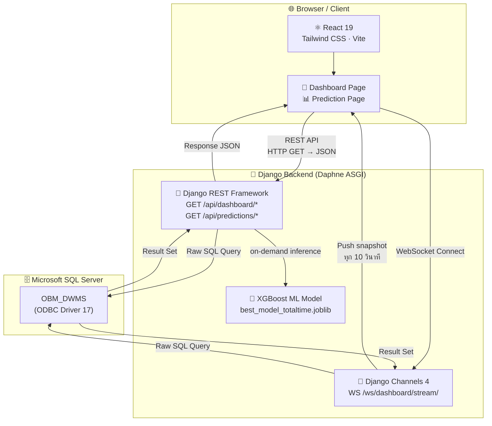

# WMS — Warehouse Management System

> ระบบบริหารจัดการคลังสินค้าแบบ Real-time สำหรับโรงงาน **SB1**  
> ติดตามคิวรถบรรทุก · ตรวจสอบสถานะ Yard · พยากรณ์เวลาโหลดด้วย AI

---

## สารบัญ

- [ภาพรวมระบบ](#ภาพรวมระบบ)
- [คุณสมบัติหลัก](#คุณสมบัติหลัก)
- [Tech Stack](#tech-stack)
- [สถาปัตยกรรมระบบ](#สถาปัตยกรรมระบบ)
- [โครงสร้างโปรเจกต์](#โครงสร้างโปรเจกต์)
- [ข้อกำหนดเบื้องต้น](#ข้อกำหนดเบื้องต้น)
- [การติดตั้ง](#การติดตั้ง)
- [Environment Variables](#environment-variables)
- [การรันระบบ](#การรันระบบ)
- [API Endpoints](#api-endpoints)
- [WebSocket](#websocket)
- [ML Model — การพยากรณ์เวลาโหลด](#ml-model--การพยากรณ์เวลาโหลด)
- [การ Deploy (Production)](#การ-deploy-production)
- [Contributing](#contributing)

---

## ภาพรวมระบบ

WMS เป็นระบบ Dashboard แบบ Real-time สำหรับควบคุมและติดตามการโหลดสินค้าภายในโรงงาน SB1 ครอบคลุมตั้งแต่การรับรถเข้าคิว ไปจนถึงการออกจากโรงงาน โดยอัตโนมัติดึงข้อมูลจากระบบ DWMS ผ่าน Microsoft SQL Server และแสดงผลแบบ Live ผ่าน WebSocket

ระบบยังมีโมดูล AI ที่ฝึกด้วย XGBoost เพื่อพยากรณ์เวลาโหลดสินค้าของรถแต่ละคัน ช่วยให้ทีมวางแผนการจัดส่งได้แม่นยำยิ่งขึ้น

| รายละเอียด | ค่า |
|-----------|-----|
| Plant | SB1 (Samung Business 1) |
| Plant Code | `COM20060001` |
| Timezone | `Asia/Bangkok` (UTC+7) |
| Language | ภาษาไทย |

---

## คุณสมบัติหลัก

### Dashboard Real-time
- สรุปจำนวนรถตามสถานะ: รอคิว · กำลังโหลด · เสร็จสิ้น · เกินเวลา · ช่องว่าง
- อัปเดตอัตโนมัติทุก **10 วินาที** ผ่าน WebSocket
- แสดงเวลาอัปเดตล่าสุดและสถานะการเชื่อมต่อ

### คิวรถบรรทุก (Truck Queue)
- แสดงรายการรถทุกคันพร้อม: ทะเบียน · ประเภทรถ · ประเภทคิว (SmartQ / Walk-in / ล่วงหน้า)
- ข้อมูลสินค้า: กระเบื้อง CPAC / PRESTIGE / NEUSTILE · อุปกรณ์เสริม
- Timeline timestamps: เข้าคิว · เรียกรถ · เริ่มโหลด · โหลดเสร็จ · ออก
- ค้นหาและกรองตามประเภทคิว / สถานะ

### Yard Management
- แผนผัง Yard แบบ Zone แสดงสถานะช่องโหลดทุกช่อง
- ข้อมูล Forklift: ชื่อพนักงาน · เวลาทำงานล่าสุด · จำนวนรถในช่อง
- สถานะช่อง: ว่าง / กำลังโหลด

### การแจ้งเตือน (Notifications)
- แจ้งเตือน 3 ประเภท: รอเรียกรถ · รอโหลด · รอปิด
- ระดับความเร่งด่วน: เตือน / ส้ม / วิกฤต
- เสียงแจ้งเตือนและ Toast popup
- กำหนดขอบเขตเวลา: 5, 10, 15 นาที

### AI Prediction Report
- รายงานความแม่นยำโมดูล ML: MAE · RMSE · Accuracy (±15 นาที)
- เปรียบเทียบเวลาพยากรณ์ vs เวลาจริงรายคัน
- Export CSV · Pagination · Filter

---

## Tech Stack

### Backend

| เทคโนโลยี | เวอร์ชัน | วัตถุประสงค์ |
|-----------|---------|------------|
| Python | 3.x | ภาษาหลัก |
| Django | 5.2 | Web framework |
| Django REST Framework | 3.17 | REST API |
| Django Channels | 4.2 | WebSocket (ASGI) |
| Daphne | 4.1 | ASGI server |
| drf-spectacular | ≥ 0.27 | OpenAPI docs (Swagger/ReDoc) |
| mssql-django | 1.7 | SQL Server ORM backend |
| pyodbc | 5.3 | ODBC Database driver |
| XGBoost | latest | ML model (ทำนายเวลาโหลด) |
| Pandas / NumPy | latest | Data processing |
| joblib | latest | Model serialization |
| python-dotenv | 1.2 | Environment variables |

### Frontend

| เทคโนโลยี | เวอร์ชัน | วัตถุประสงค์ |
|-----------|---------|------------|
| React | 19.0 | UI framework |
| Vite | 6.2 | Build tool & Dev server |
| Tailwind CSS | 4.1 | Utility-first styling |
| Axios | 1.13 | HTTP client |
| react-use-websocket | 4.13 | WebSocket hook |
| Lucide React | 1.8 | Icon library |
| Material-UI Icons | 7.3 | Supplemental icons |
| Emotion | latest | CSS-in-JS |

### Infrastructure

| ส่วนประกอบ | รายละเอียด |
|-----------|-----------|
| Database | Microsoft SQL Server (`OBM_DWMS`) |
| ODBC Driver | ODBC Driver 17 for SQL Server |
| API Protocol | REST + WebSocket |

---

## สถาปัตยกรรมระบบ



**Data Flow:**

1. **REST API** — Frontend เรียก `/api/dashboard/*` และ `/api/predictions/*` ด้วย HTTP GET รับ JSON กลับมา
2. **WebSocket** — Frontend เปิด connection ถาวรไปที่ `/ws/dashboard/stream/` รับ snapshot push ทุก 10 วินาที
3. **SQL Server** — Backend ดึงข้อมูลด้วย Raw SQL ผ่าน ODBC Driver 17 (ไม่ใช้ Django ORM)
4. **ML Model** — XGBoost รัน inference แบบ on-demand เมื่อมีการเรียก `/api/predictions/report/`

---

## โครงสร้างโปรเจกต์

```
WMS/
├── README.md                       ← ไฟล์นี้
│
├── backend/                        ← Django Backend
│   ├── manage.py
│   ├── requirements.txt            ← Python dependencies
│   ├── .env                        ← Environment variables (ไม่ commit)
│   │
│   ├── backend/                    ← Django project config
│   │   ├── settings.py
│   │   ├── urls.py                 ← Root URL routing
│   │   ├── asgi.py                 ← ASGI app + WebSocket routing
│   │   └── wsgi.py
│   │
│   ├── api/                        ← Main Django app
│   │   ├── views.py                ← API view functions (5 endpoints)
│   │   ├── urls.py                 ← API URL routes
│   │   ├── models.py               ← (ว่าง — ใช้ raw SQL)
│   │   ├── websocket.py            ← WebSocket consumer
│   │   ├── constants.py            ← App-wide constants
│   │   ├── services/               ← Business logic (6 modules)
│   │   ├── utils/                  ← DB utilities, date helpers, SQL fragments
│   │   └── ml/                     ← ML pipeline
│   │       ├── predict.py          ← Inference pipeline
│   │       ├── engineer.py         ← Feature engineering
│   │       └── train_pipeline.py   ← Model training script
│   │
│   └── model/
│       ├── best_model_totaltime.joblib   ← Trained XGBoost model
│       └── feature_metadata.json         ← Feature names & metadata สำหรับ inference
│
└── frontend/                       ← React Frontend
    ├── package.json
    ├── vite.config.js
    ├── .env                        ← Environment variables (ไม่ commit)
    │
    └── src/
        ├── app/                    ← Entry point
        │   ├── index.jsx           ← main entry (index.html → src/app/index.jsx)
        │   ├── App.jsx             ← Root component + navigation state
        │   └── router.jsx          ← Route definitions
        │
        ├── features/               ← แต่ละ feature อยู่ครบในที่เดียว (co-located)
        │   ├── dashboard/          ← components/, hooks/, utils/, constants/, index.js
        │   ├── queue/              ← components/, hooks/, utils/, constants/, index.js
        │   ├── yard/               ← components/, hooks/, utils/, constants/, index.js
        │   ├── prediction/         ← components/, hooks/, utils/, constants/, index.js
        │   └── notifications/      ← components/, hooks/, utils/, constants/
        │
        ├── shared/                 ← ของที่ใช้ร่วมกันหลาย feature
        │   ├── components/         ← StatusBadge, QueueStatusBadge, WaitingTimeBar,
        │   │                           YardSlotStatusBadge, BottomSheet,
        │   │                           InfoSection, ModalIconHeader
        │   ├── hooks/              ← useLiveClock, useModal
        │   ├── utils/              ← dateTime, text
        │   └── constants/          ← app.js, dateTime.js
        │
        ├── services/               ← API clients
        │   ├── apiClient.js        ← Axios instance
        │   ├── dashboardService.js
        │   └── predictionService.js
        ├── config/                 ← Environment config (อ่านจาก .env)
        ├── layouts/                ← DashboardLayout, Header
        ├── pages/                  ← Page components (thin composition — ไม่มี logic)
        │   ├── DashboardPage.jsx
        │   └── PredictionPage.jsx
        └── styles/                 ← Global CSS
```

---

## ข้อกำหนดเบื้องต้น

ก่อนติดตั้ง ตรวจสอบว่ามีซอฟต์แวร์ต่อไปนี้พร้อมแล้ว:

| ซอฟต์แวร์ | เวอร์ชันขั้นต่ำ | หมายเหตุ |
|-----------|--------------|---------|
| Python | 3.10+ | [python.org](https://www.python.org/) |
| Node.js | 18+ | [nodejs.org](https://nodejs.org/) |
| npm | 9+ | มาพร้อม Node.js |
| Microsoft SQL Server | 2017+ | หรือ Azure SQL |
| ODBC Driver 17 for SQL Server | 17.x | [Microsoft Docs](https://learn.microsoft.com/en-us/sql/connect/odbc/download-odbc-driver-for-sql-server) |

---

## การติดตั้ง

### ขั้นตอนที่ 1 — Clone Repository

```bash
git clone <repository-url>
cd WMS
```

---

### ขั้นตอนที่ 2 — ติดตั้ง Backend

#### 2.1 สร้าง Virtual Environment

```bash
cd backend

# สร้าง virtual environment
python -m venv venv
```

#### 2.2 เปิดใช้งาน Virtual Environment

**Windows (PowerShell):**

```powershell
venv\Scripts\Activate.ps1
```

**Windows (Command Prompt):**

```cmd
venv\Scripts\activate.bat
```

**macOS / Linux:**

```bash
source venv/bin/activate
```

> เมื่อ activate สำเร็จ จะเห็น `(venv)` นำหน้า prompt

#### 2.3 ติดตั้ง Python Dependencies

```bash
pip install -r requirements.txt
```

#### 2.4 สร้างไฟล์ `.env`

สร้างไฟล์ `backend/.env` แล้วกรอกข้อมูลให้ตรงกับ environment จริง:

```env
DB_ENGINE=mssql
DB_NAME=OBM_DWMS
DB_USER=your_db_user
DB_PASSWORD=your_db_password
DB_HOST=your_sql_server_host
DB_PORT=1433
DB_TRUST_SERVER_CERTIFICATE=yes
SECRET_KEY=your-secret-key-here
DEBUG=True
```

> สร้าง `SECRET_KEY` ด้วยคำสั่ง:
>
> `python -c "from django.core.management.utils import get_random_secret_key; print(get_random_secret_key())"`

#### 2.5 รัน Database Migration

```bash
python manage.py migrate
```

---

### ขั้นตอนที่ 3 — ติดตั้ง Frontend

#### 3.1 ติดตั้ง Node Dependencies

```bash
cd ../frontend
npm install
```

#### 3.2 สร้างไฟล์ `.env`

สร้างไฟล์ `frontend/.env`:

```env
VITE_API_ORIGIN=http://127.0.0.1:8000
VITE_WS_ORIGIN=ws://127.0.0.1:8000
```

> หาก Backend รันบน host หรือ port อื่น ให้เปลี่ยน URL ตรงนี้ด้วย

---

## Environment Variables

### Backend (`backend/.env`)

| Variable | ตัวอย่าง | คำอธิบาย |
|----------|---------|---------|
| `DB_ENGINE` | `mssql` | Database backend |
| `DB_NAME` | `OBM_DWMS` | ชื่อ Database |
| `DB_USER` | `sa` | SQL Server username |
| `DB_PASSWORD` | `P@ssw0rd` | SQL Server password |
| `DB_HOST` | `localhost` | SQL Server hostname/IP |
| `DB_PORT` | `1433` | SQL Server port |
| `DB_TRUST_SERVER_CERTIFICATE` | `yes` | เชื่อถือ self-signed cert |
| `SECRET_KEY` | `django-insecure-...` | Django secret key |
| `DEBUG` | `True` / `False` | Debug mode |

### Frontend (`frontend/.env`)

| Variable | ตัวอย่าง | คำอธิบาย |
|----------|---------|---------|
| `VITE_API_ORIGIN` | `http://127.0.0.1:8000` | Base URL ของ Backend REST API |
| `VITE_WS_ORIGIN` | `ws://127.0.0.1:8000` | Base URL ของ WebSocket server |

---

## การรันระบบ

### Development Mode

เปิด **2 Terminal** แยกกัน แล้วรันตามลำดับ:

---

#### Terminal 1 — Backend

**Windows (PowerShell):**

```powershell
cd backend
venv\Scripts\Activate.ps1
daphne -b 127.0.0.1 -p 8000 backend.asgi:application
```

**macOS / Linux:**

```bash
cd backend
source venv/bin/activate
daphne -b 127.0.0.1 -p 8000 backend.asgi:application
```

> **ทำไมต้องใช้ Daphne?** Django Channels (WebSocket) ต้องการ ASGI server
> หากใช้ `python manage.py runserver` จะไม่รองรับ WebSocket และ dashboard จะไม่อัปเดต real-time

เมื่อรันสำเร็จจะเห็น:

```text
2025-xx-xx xx:xx:xx INFO     Starting server at tcp:interface=127.0.0.1:port=8000
```

---

#### Terminal 2 — Frontend

```bash
cd frontend
npm run dev
```

เมื่อรันสำเร็จจะเห็น:

```text
  VITE v6.x.x  ready in xxx ms

  ➜  Local:   http://localhost:3000/
  ➜  Network: http://0.0.0.0:3000/
```

เปิดเบราว์เซอร์ที่ `http://localhost:3000`

---

### Frontend Scripts

| คำสั่ง | คำอธิบาย |
| ------- | --------- |
| `npm run dev` | รัน dev server พร้อม Hot Module Replacement |
| `npm run build` | Build สำหรับ production → ไฟล์ output ที่ `dist/` |
| `npm run preview` | Preview production build ที่ local ก่อน deploy |
| `npm run test` | รัน unit tests |
| `npm run test:watch` | รัน tests แบบ watch mode |

### URLs สำคัญ

| URL | คำอธิบาย |
|-----|---------|
| `http://localhost:3000` | Frontend Dashboard |
| `http://localhost:8000/api/docs/` | Swagger UI (API Documentation) |
| `http://localhost:8000/api/redoc/` | ReDoc (API Documentation) |
| `http://localhost:8000/api/schema/` | OpenAPI 3.0 JSON Schema |

### ดู API ด้วย Swagger UI

1. รัน Backend ให้เรียบร้อยก่อน (ดู [Terminal 1 — Backend](#terminal-1--backend))
2. เปิดเบราว์เซอร์ไปที่ `http://localhost:8000/api/docs/`
3. จะเห็นรายการ API ทั้งหมดพร้อม parameter และ response schema
4. กด **Try it out** → **Execute** เพื่อทดสอบ API ได้เลยโดยไม่ต้องเขียนโค้ด

> หากต้องการ interface แบบเรียบอ่านง่าย ใช้ ReDoc ที่ `http://localhost:8000/api/redoc/` แทน

---

## API Endpoints

Base URL: `http://localhost:8000`

### Dashboard

| Method | Endpoint | Query Params | คำอธิบาย |
|--------|----------|-------------|---------|
| `GET` | `/api/dashboard/summary/` | — | สรุปจำนวนรถตามสถานะ (รอ/โหลด/เสร็จ/เกินเวลา) |
| `GET` | `/api/dashboard/snapshot/` | `plant_code` | ข้อมูล dashboard ทั้งหมด (cached 10 วินาที) |
| `GET` | `/api/dashboard/truck_queues/` | — | รายการรถในคิวพร้อมรายละเอียดทั้งหมด |
| `GET` | `/api/dashboard/post-locations/` | `plant_code` | สถานะ Yard · Channel · Forklift |

### Predictions

| Method | Endpoint | คำอธิบาย |
|--------|----------|---------|
| `GET` | `/api/predictions/report/` | รายงานความแม่นยำ ML model (MAE, RMSE, accuracy ±15 นาที) |

### Documentation

| Method | Endpoint | คำอธิบาย |
|--------|----------|---------|
| `GET` | `/api/schema/` | OpenAPI 3.0 schema (JSON) |
| `GET` | `/api/docs/` | Swagger UI |
| `GET` | `/api/redoc/` | ReDoc |

### ตัวอย่าง Response — `GET /api/dashboard/snapshot/`

```json
{
  "summary": {
    "total": 12,
    "waiting": 4,
    "loading": 6,
    "completed": 2,
    "overtime": 1,
    "available_bays": 5,
    "loading_bays": 6
  },
  "truck_queues": [...],
  "post_locations": [...]
}
```

---

## WebSocket

### Connection

```
ws://localhost:8000/ws/dashboard/stream/?plant_code=COM20060001
```

| Parameter | ค่าเริ่มต้น | คำอธิบาย |
|-----------|-----------|---------|
| `plant_code` | `COM20060001` | รหัส Plant (ไม่บังคับ) |

### Events

**รับจาก Server:**

```json
{
  "type": "dashboard.snapshot",
  "data": {
    "summary": { ... },
    "truck_queues": [ ... ],
    "post_locations": [ ... ]
  }
}
```

**ส่งหา Server (Heartbeat):**

```json
{ "type": "ping" }
```

**ตอบกลับ:**

```json
{ "type": "pong" }
```

### พฤติกรรม
- Server push ข้อมูลใหม่ทุก **10 วินาที** โดยอัตโนมัติ
- Frontend reconnect อัตโนมัติเมื่อการเชื่อมต่อขาด
- ใช้ Django Channels in-memory layer สำหรับ broadcast

---

## ML Model — การพยากรณ์เวลาโหลด

### ภาพรวม

โมดูล ML ใช้ **XGBoost Regression** เพื่อพยากรณ์เวลารวมตั้งเเต่เข้า-ออกโรงงาน (นาที) ของรถแต่ละคัน

**Model file:** `backend/model/best_model_totaltime.joblib`

### Features ที่ใช้พยากรณ์

| กลุ่ม | Features |
|-------|---------|
| **ข้อมูลรถ** | ประเภทรถ (4/6/10 ล้อ, หัวลาก), ประเภทคิว (SmartQ/Walk-in/ล่วงหน้า), PrepareForward |
| **ข้อมูลสินค้า** | จำนวนกระเบื้อง (CPAC/PRESTIGE/NEUSTILE), จำนวนอุปกรณ์, จำนวนอุปกรณ์เสริม, ยอดรวม |
| **สภาพคิว** | รถรอ, รถโหลด, รถปิด, รถทั้งหมด, ช่องว่าง |
| **เวลา** | ชั่วโมง, วันในสัปดาห์, สัปดาห์ของเดือน, เดือน |
| **Rolling Average** | เวลาเฉลี่ย 5 คันล่าสุด, เวลาเฉลี่ยตามประเภทรถ 10 คันล่าสุด |
| **Derived** | sap_per_group, queue×bays, queue×sap, inter_arrival_min |

### Metrics

| Metric | คำอธิบาย |
|--------|---------|
| **MAE** | Mean Absolute Error (นาที) |
| **RMSE** | Root Mean Squared Error (นาที) |
| **Accuracy ±15 min** | % ของการพยากรณ์ที่คลาดเคลื่อนไม่เกิน 15 นาที |

### การ Retrain Model

```bash
cd backend
python -m api.ml.train_pipeline
```

โมเดลใหม่จะถูกบันทึกไปที่ `backend/model/best_model_totaltime.joblib` โดยอัตโนมัติ

---

## การ Deploy (Production)

### Backend

```bash
# ปิด Debug mode
DEBUG=False

# รัน Daphne ด้วย production settings
daphne -b 0.0.0.0 -p 8000 backend.asgi:application

# หรือใช้ Supervisor / systemd สำหรับ process management
```

> **หมายเหตุ:** ตรวจสอบ `ALLOWED_HOSTS` ใน `settings.py` ให้ตรงกับ hostname จริงก่อน deploy

### Frontend

```bash
cd frontend
npm run build
# ไฟล์ output อยู่ใน frontend/dist/
```

### Checklist ก่อน Deploy

- [ ] ตั้งค่า `DEBUG=False` ใน `.env`
- [ ] ตั้งค่า `SECRET_KEY` ที่แข็งแรงและไม่ซ้ำใคร
- [ ] กำหนด `ALLOWED_HOSTS` ให้ถูกต้อง
- [ ] ตั้งค่า `CORS_ALLOWED_ORIGINS` เฉพาะ domain ที่อนุญาต
- [ ] ตรวจสอบ ODBC Driver และการเชื่อมต่อ SQL Server
- [ ] ตรวจสอบ model file `best_model_totaltime.joblib` มีอยู่ในตำแหน่งที่ถูกต้อง
- [ ] รัน `python manage.py collectstatic` สำหรับ Django Admin (ถ้าใช้)

---

## Contributing

### Git Workflow

```bash
# สร้าง branch ใหม่จาก main
git checkout -b feature/your-feature-name

# พัฒนา และ commit
git add .
git commit -m "feat: คำอธิบายการเปลี่ยนแปลง"

# Push และ เปิด Pull Request
git push origin feature/your-feature-name
```

### Commit Message Convention

| Prefix | ใช้เมื่อ |
|--------|---------|
| `feat:` | เพิ่มฟีเจอร์ใหม่ |
| `fix:` | แก้ไข bug |
| `refactor:` | ปรับโครงสร้างโค้ด |
| `docs:` | อัปเดตเอกสาร |
| `style:` | แก้ไข formatting / CSS |
| `chore:` | งาน maintenance (dependencies, config) |

### Code Style

- **Backend:** ปฏิบัติตาม [PEP 8](https://peps.python.org/pep-0008/) · ใช้ type hints เมื่อเป็นไปได้
- **Frontend:** ESLint + Prettier · Component names ใช้ PascalCase · hooks ใช้ camelCase นำด้วย `use`
- **SQL:** Parameterized queries เสมอ — ห้ามต่อ string โดยตรง

### โครงสร้างทีม

| บทบาท | ความรับผิดชอบ |
|-------|-------------|
| Backend Dev | Django API · SQL queries · WebSocket · ML pipeline |
| Frontend Dev | React components · hooks · Tailwind UI |
| DevOps | Deploy · SQL Server |

---

<div align="center">

**WMS — Warehouse Management System**  
SB1 Plant · Built with Django + React · Real-time · AI-Powered

</div>
